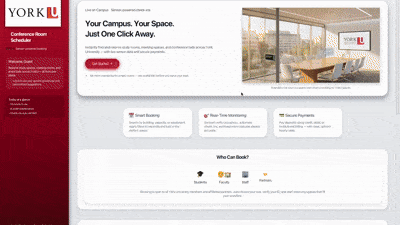
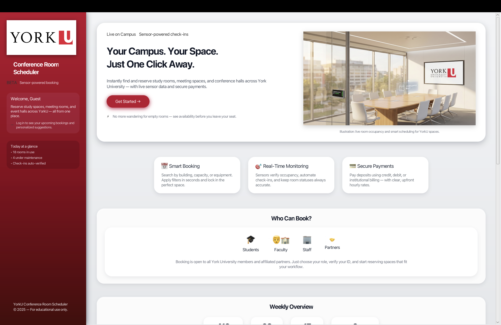
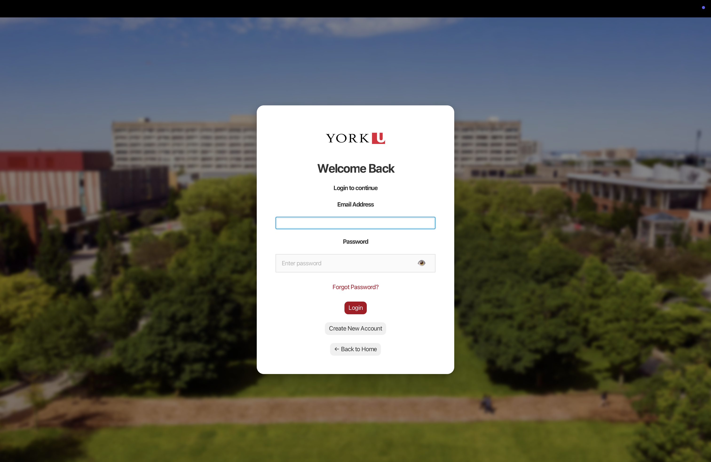
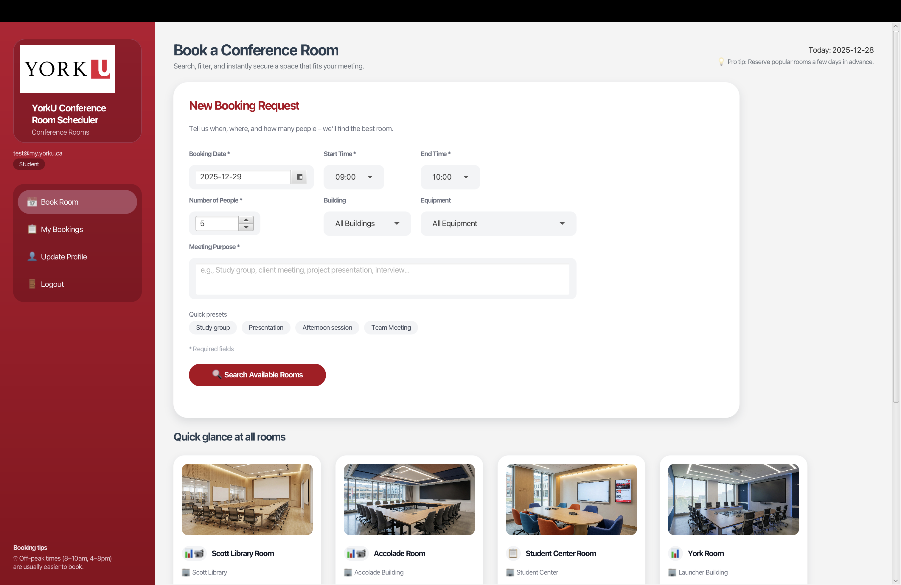
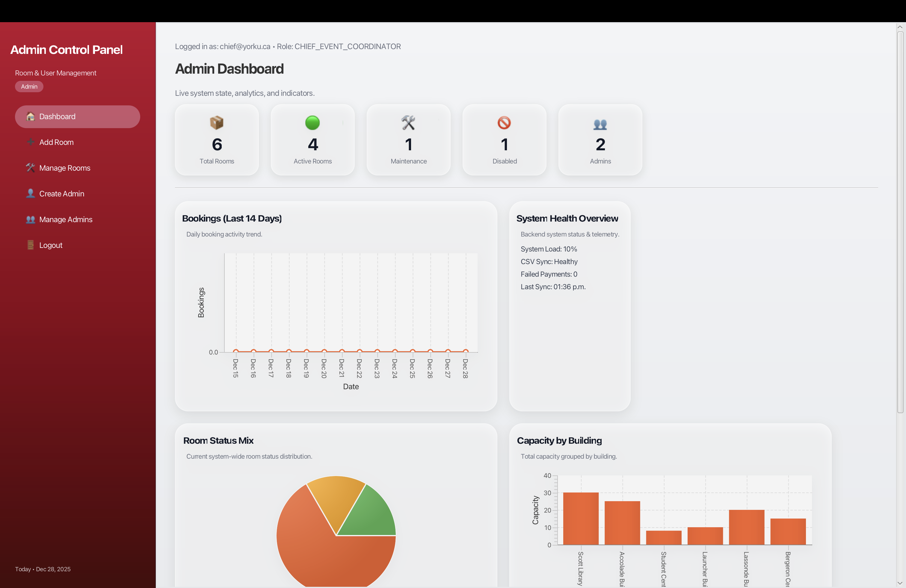

# 🏢 Conference Room Scheduler – York University

A **JavaFX-based conference room scheduling system** designed to simulate a real-world
university room booking platform. The application enables students, faculty, staff,
and partners to **securely book rooms**, manage reservations, process payments, and
track real-time room status using **sensor-powered check-ins**.

---

## 🎥 UI Walkthrough

*A short walkthrough showcasing the landing page, authentication flow, room booking interface, and administrative dashboard.*

---

## 🎯 Project Objective

The goal of this project was to design and implement a **robust, extensible, and well-tested room booking platform** that demonstrates:

- Object-Oriented Design principles
- Proper use of **software design patterns**
- Clean **layered architecture**
- Comprehensive **testing and quality assurance**
- A polished, real-world **graphical user interface**

---

## 🧩 Key Features

### 👤 User & Account Management
- User registration with **email validation** and **strong password rules**
- Support for multiple user roles:
  - Student
  - Faculty
  - Staff
  - Partner
- University account verification for `@yorku.ca` / `@my.yorku.ca` emails
- Secure login, logout, and profile management
- Password recovery support

---

### 📅 Room Booking & Scheduling
- Search and book available conference rooms
- Conflict detection to prevent overlapping bookings
- Role-based hourly pricing:
  - Students — **$20/hr**
  - Faculty — **$30/hr**
  - Staff — **$40/hr**
  - Partners — **$50/hr**
- Edit or cancel bookings **before start time**
- Extend bookings if the next time slot is available

---

### 💳 Payments & No-Show Handling
- One-hour **deposit charged upfront**
- Deposit applied toward final cost upon valid check-in
- **Automatic no-show detection**
  - Deposit forfeited if no check-in within 30 minutes
- Supported payment methods:
  - Credit Card
  - Debit Card
  - Institutional / Partner Billing

---

### 🛰 Sensor Simulation & Live Room Status
- Simulated occupancy sensors and badge-based check-ins
- Automatic room state transitions:
  - `AVAILABLE → IN_USE → NO_SHOW`
- Real-time UI updates when room status changes

---

### 🛠 Administrative Controls
- Chief Event Coordinator can auto-generate admin accounts
- Admins can:
  - Add new rooms
  - Enable / disable rooms
  - Place rooms under maintenance
- System-wide updates reflected instantly across the application
- Administrative dashboards for system monitoring

---

## 🖥 User Interface

### 🏠 Main Page

### 🔐 Login Screen

### 📅 User Dashboard & Booking

### 🛠 Admin Dashboard

---

## 🖥 Technology Stack

- **Language:** Java 23  
- **GUI Framework:** JavaFX  
- **Build Tool:** Maven  
- **Data Persistence:** CSV files (file-based storage)  
- **Testing:** JUnit, Randoop, PIT (Mutation Testing)  
- **IDE:** IntelliJ IDEA  

---

## 🧠 System Architecture

The system follows a **three-layered architecture**:

### 1️⃣ Application Layer (UI)
- Authentication UI
- Booking UI
- Admin UI
- Navigation & routing

### 2️⃣ Core Logic Layer
- `UserManager`
- `BookingManager`
- `RoomStatusManager`
- `PaymentContext` & payment strategies
- `SensorSystem`

### 3️⃣ Infrastructure Layer
- CSV repositories
- File resolver
- CSV helper utilities

This design enforces **high cohesion**, **low coupling**, and strong separation of concerns.

---

## 🏗 Design Patterns Used

| Design Pattern | Purpose |
|---------------|--------|
| **Singleton** | Ensures a single shared instance of repositories and managers |
| **Builder** | Safe and flexible construction of `User` and `Booking` objects |
| **Strategy** | Interchangeable payment processing algorithms |
| **Observer** | Real-time room and booking status updates |
| **Factory** | Centralized creation of UI components and rooms |
| **Facade** | Simplified interaction with sensor and room-status subsystems |

Each pattern was chosen deliberately and justified based on system requirements.

---

## ▶️ How to Run the Application

### ✅ Recommended (Maven – No JavaFX Setup Needed)

    mvn javafx:run

**Requirements:**
- Java 23
- Maven

Maven automatically:
- Downloads JavaFX
- Configures module paths
- Launches the application

---

### ⚠️ Manual Run (Optional – IntelliJ)

If running directly from IntelliJ:
- Install JavaFX SDK
- Add the following VM options:

    --module-path /path/to/javafx/lib
    --add-modules javafx.controls,javafx.fxml

---

## 🧪 Testing & Quality Assurance

### ✅ Manual JUnit Tests (Non-GUI)
- **Class Coverage:** 100%
- **Method Coverage:** 98%
- **Line Coverage:** 95%
- **Tests Passed:** 844 / 844

Fully covers:
- User management
- Booking logic
- Payment strategies
- Sensor simulation
- Room status management
- Core models and utilities

---

### 🤖 Randoop (Automated Testing)
- **Class Coverage:** ~50%
- **Method Coverage:** 100%
- **Line Coverage:** ~86%

Used to explore unexpected execution paths and stress-test backend logic.

---

### 🧬 Mutation Testing (PIT)
- **Mutation Coverage:** ~32%
- **Test Strength:** ~90%

Lower mutation coverage is due to intentionally excluded infrastructure classes.  
Manual tests successfully killed most mutants where applied.

---

## 🎥 Demo Video

📺 **YouTube Demo:**  
https://www.youtube.com/watch?v=2ehBNyhx8fY

---

## 👥 Team & Contributions

**Group 8 – EECS 3311**

- **Shivam Gupta** *(Lead Project Manager & Primary Contributor)*  
  - Core system integration  
  - User authentication & profile management  
  - Sensor simulation & room status logic  
  - Documentation and design ownership  

- Kartik Sharma — Booking workflow & UI  
- Sharwin Verma — Admin features & testing documentation  
- Himanshi Verma — Architecture & diagrams  
- Meem Morshed — Sensor testing & demo video  

---

## ⚠️ Academic Disclaimer

This project was developed as part of **EECS 3311 – Software Design** at York University.  
It is shared **for educational and portfolio purposes only**.

---

⭐ If you find this project interesting, feel free to explore the code and documentation.
